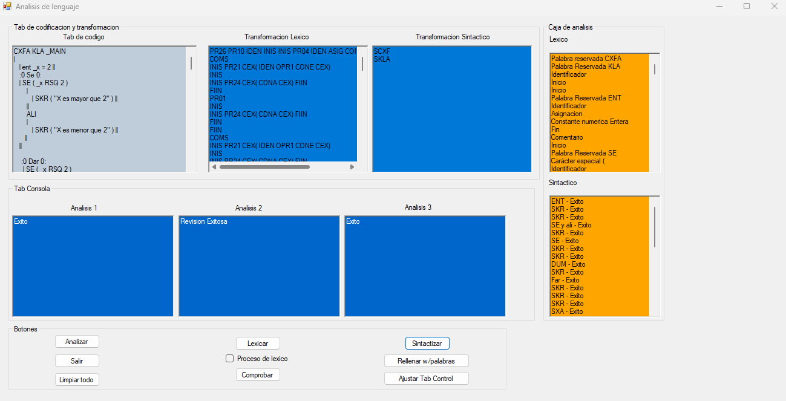

# Ejemplo de programa



# Codigo de prueba 
```
CXFA KLA _MAIN 
| 
   | ent _x = 2 ||
   :0 Se 0:
   | SE ( _x RSQ 2 )
       |
          | SKR ( "X es mayor que 2" ) ||
       ||
       ALI
       |
          | SKR ( "X es menor que 2" ) ||
      ||
   ||

    :0 Dar 0:
     | SE ( _x RSQ 2 )
         |
             | SKR ( "X es mayor que 2" ) ||
              | DAR ||
          ||
     ||

     :0 SKR 0:
     | SKR ( "Resultado: " + 2 + _letra ) ||

    :0 DUM 0:
     | DUM ( _x RSQ 5 ) 
           | SKR ( _x ) ||
           | _x = _x + 1 ||
     ||

     :0 Far 0:
    | FAR
         | SKR ( _x ) ||
         | _x = _x + 1 ||
     DUM ( _x RSQ 5 ) ||

   :0 KAZ SXA ROM 0:

    SXA ( _entero1 )
    |
        | KAZ 1 :
               | SKR ( "El valor es 1" ) ||
               | ROM ||
         ||
         | KAZ 2 :
               | SKR ( "El valor es 2" ) ||
               | ROM ||
         ||
         ALI
         |
              | SKR ( "Esta vacio" ) ||
              | ROM ||
         ||
    ||


     :0 ENT 0:
     | ENT _entero1 = 1 ||

     :0 KAR 0:
     | KAR _caracter = 'c' || 

     
      :0 KAP 0:
      | KAP ( _Variable1 ) ||

      :0 LOG 0:
      | LOG _boolean = VERA || 

      :0 LEG 0:
      | LEG ( 1000 ) ||

      :0 MAT 0:
      | MAT ent [ ] _arreglo = NOV ent [ 2 ] ||
      | _arreglo [ 1 ] = 323 ||
      | SKR ( "Res " + _arreglo [ 1 ] ) ||

     :0 POR 0:
     | POR ( | ent _i = 0 ||
                   | _i RSQ 5 ||
                   | _i ++ || )
            | SKR ( "Res" + _i ) ||
     ||

      :0 PRX 0:
      PRX ( ent _val _arreglo1 )
      |
            | skr ( "tc: " + _var ) ||
      ||

      :0 REA 0:
      | REA _real = 12.53 ||

      :0 SXN 0:
      | SXN _cadena = "Hola" ||
       
      | ent _a = 1 , _b = 2 ||
      | OBJ _Operaciones _op = nov _Operaciones ( _a , _b ) ||
      | SKR ( _op._Suma( ) ) ||
||


kla _Operaciones
|
    | ent _num1 = 0 ||
    | ent _num2 ||
    _Operaciones( ent _n1 , ent _n2 )
    |
        | _num1 = _n1 ||
        | _num2 = _n2 ||
    ||
    | ent _resultado ||
    ent _Suma( )
    | 
       | rev _num1 + _num2 ||
     ||
    ent _Resta( )
    | 
       | rev _num1 - _num2 ||
    ||
    rea _Multiplicacion( )
    | 
       | rev _num1 * _num2 ||
    ||
    ent _Division( )
    | 
         | rev _num1 + _num2 ||
    ||
||
```
